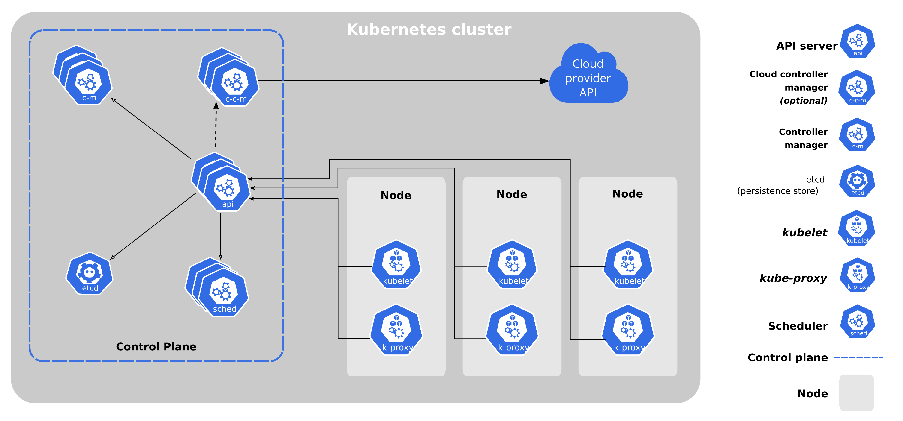

# K8s <sub>Kubernetes</sub> Hands-On

컨테이너 환경에서 서비스를 운영하다보면 컨테이너 수가 많아지면서 몇가지 고민이 생기기 마련이다. 대표적으로 배포 관리, 제어, 모니터링, 스케일링, 네트워킹 등.. 을 하기위해 별도의 구성을 하기위해 고민이 생긴다. 이를 관리하는 채계가 없을 때, 이를 해결하기 위해 수동적으로 찾아 해결을 하여야하지만 규모가 커질수록 관리가 어려워진다.

위와 같은 문제를 해결하기위해 `컨테이너 오케스트레이션` 을 사용하여 관리의 복잡성을 줄이고 자동화할 수 있다. 이러한 오케스트레이션 중 대표적인것이 `K8s` 이다.

K8s 는 서비스 디스커버리와 스케일링, 스토리지 오케스트레이션, 자동화된 롤아웃과 롤백, 자동화된 빈 패킹, 자동화된 복구, 시크릿과 구성 관리 등.. 의 다양한 기능을 제공해준다.

위 기능에 대한 자세한 설명은 [K8s Docs](https://kubernetes.io/ko/docs/concepts/overview/) 에서 확인할 수 있다.

<sup>* ref: [nhn cloud 컨테이너 기술 중 ..](https://youtu.be/fivJy6fYmRo?si=4j_XNurgoQcbO2Vl&t=562) </sup>

#### 여담

>  Kubernetes 는 '조타수', '파일럿' 을 의미하는 그리스어에서 유래하였으며, K8s 라는 표기는 Kubernetes 의 맨앞과 맨뒷글자 'K', 's' 그리고 그 사이의 8글자를 의미한다.

> K8s 은 Google 내부에서 사용하기위한 통합 컨테이너 관리를 위해 Borg 라는 시스템을 개발한 것으로 시작되었다. 이후 Google 내부에서 Omega 라는 시스탬을 한차례 더 개발 한 후, 2015년 논문과 함께 Kubernetes를 공식적으로 발표하였다. 현재는 리눅스 재단 산하의 CNCF 재단에 기증되었다.

## K8s 구조

K8s 는 기본적으로 클러스터 단위로 동작을 하고있으며, 용도에 따라 Worker Node 와 Master Node로 구분된다.



> 클러스터 <sub>Cluster</sub>  
> 각기 다른 서버들을 하나로 묶은 집합으로 하나의 시스템 같이 동작하게 하는 것이다.
> 
> 따라서 K8s 에서의 Cluster 는 컨테이너 형태의 어플리케이션을 호스팅하는 물리/가상 노드들의 집합이라고 볼 수 있다.

> 워커 노드 <sub>Worker Node</sub>  
> 컨테이너가 실제 배치되는 노드이다

> 마스터 노드 <sub>Master Node</sub> ( Control Plane )  
> 클러스터의 전체를 관리하는 노드이다.

### Control Plane Components

Control Plane 은 Master Node 에 해당하며, Control Plane 은 클러스터 전체의 워크로드 리소스 등 주요 구성 요소를 배포하고 제어하는 역할을 한다. 아래는 Control Plane 에 해당하는 기능이다.

<sup>* 워크로드 <sub>Workload</sub>: 쿠버네티스 상에서 동작되는 어플리케이션을 의미</sup>

 - etcd:   
 Key-Value 형태의 스토리지이며, 클러스터 안의 각 구성요소들에 대한 상태나 설정 정보가 저장된다.

 - API Server:  
 쿠버네티스의 명령과 통신을 위한 API 서버; Restful API 지원.

 - Controller Manager:  
 컨트롤러를 생성하고 이를 각 노드에 배포하여 관리하는 역할; 컨트롤러는 노드, 레플리케이션, 엔드포인트, 서비스 어카운트와 토큰을 관리하는 컨트롤러로 구성.

 - Kube-Scheduler:  
 Pod, 서비스 등.. 각 리소스들을 적절한 노드에 할당하는 역할.

 - Cloud Controller Manager:  
 K8s 와 Cloud Provider API 와 연동하기 위한 컨트롤러를 생성하고 이를 각 노드에 배포하며 관리하는 역할

### Node Components

Node Components 는 각 노드에서 Pod 와 컨테이너를 구동하고 관리하기 위해 필요한 요소를 말한다. Cluster 제어에 필요한 Control Plane Components 역시 개별 Pod 로 구성되기 때문에 이를 관리할 수 있는 도구가 필요하다. 따라서 Worker Node 뿐 아니라 Master Node 에도 존재한다.

 - Container Runtime Engine:  
 Cluster 내부에 컨테이너 이미지를 가져오고 구동. pod가 노드안에서 동작할 수 있도록 도와준다.
 - Kube-Proxy:  
 Cluster 의 각 Node 에서 구동되는 쿠버네티스 네트워크 프록시. 
 - Kubelet:  
 Cluster 의 각 Node 에서 실행되는 에이전트; Pod 의 spec 정보 관리/운용, Pod 를 Node 에 할당 등.. 의 역할을 수행함.

<sup>* ref: [nhn cloud Kubernetes 이해하기 중 ..](https://www.youtube.com/watch?v=9zwHZ6Xi8CA) </sup>

<sup>* ref: https://seongjin.me/kubernetes-cluster-components </sup>

### Pod 는 무엇인가?

Pod 는 1개 이상의 컨테이너가 캡슐화 되어 클러스터 안에 배포되는 가장 작은 단위의 객체이다.
Pod 는 여러개의 컨테이너를 포함할 수 있으며, 하나의 노드에 배포된다.

Pod를 구성하는 방법은 <sup>(1)</sup>kubectl 을 사용하는 방법과 <sup>(2)</sup>YAML 파일을 정의하여 구성하는 방법이 있다. 두가지 방법을 사용하여 아래와 같이 Single-Container Pod 를 구성할 수 있다.

#### kubectl 설치

Single-Container Pod 을 구성하기 전, kubectl 설치를 하여 환경을 구성하여야한다.
MacOS 에서는 `brew install kubectl` 를 통하여 설치 할 수 있다. 
이 외의 방법 또는 다른 OS 에서 설치를 위해 [설치 가이드](https://kubernetes.io/ko/docs/tasks/tools/)를 참고.

필자는 설치 후 `kubectl cluster-info` 명령을 입력하였을 때, 아래와 같은 에러가 발생하였다.
```
The connection to the server <server-name:port> was refused - did you specify the right host or port?
```

구성된 클러스터가 없기에 나는 애러이며, `kubectl config view` 명령을 통해 확인 할 수 있다. 
Docker Desktop 에서 `setting -> kubernetets -> enable kubernetes` 를 통해 간단하게 환경을 구성할 수 있으며, minikube 등.. 을 활용하는 방법도 있다.

#### 1. kubectl 을 사용하여 Single-Container Pod 구성

Master Node 에서 `kubectl run <pad name> --image=<image name>` 형태의 명령을 통해 간편하게 배포할 수 있다. 
해당 명령을 사용하여 아래와 같이 Nginx Pod 를 구성 할 수 있다.

``` sh 
kubectl run nginx --image=nginx
```

#### 2. YAML 파일을 정의하여 Single-Container Pod 구성

YAML 파일을 정의 후 `kubectl apply --f <yaml file name>` 명령을 통해 Pod 를 구성 할 수 있다. YAML 파일은 아래와 같은 형태로 정의 할 수 있다.

``` yaml 
apiVersion: v1              # Kubernetes API Version
kind: Pod                   # Object Type; Pod 을 구성하기 위해 Pod 으로 설정
metadata:                   # Object 식별을 위한 정보
  name: nginx               #   - Object name
  labels:                   #   - Pod 구동에 영향을 주지않는 순수 Key-Value 메타데이터 영역
    app: nginx              #     원하는 Key-Value 를 부여할 수 있다.
spec:                       # Object의 상태 정의
  containers:               #   - 실제 Pod 에 달길 컨테이너의 속성 
  - name: nginx-container   #     docker-compose 와 유사하다.
    image: nginx
```

위 형태에서 containers 안에 여러 컨테이너를 정의하여 Multi-Container Pod 를 구성 할 수도 있다.

#### 구성된 Pod 확인 및 관리

위와 같이 Pod 를 구성 후, `kubectl get pods` 명령을 통해 어떤 Pod 가 생성되었는지 알 수 있다. 이 외에도 아래 명령어를 통해 Pod 를 관리할 수 있다.

``` sh
# Pod 상세 정보
kubectl describe pod <pod name> 

# Pod 내부 로그 확인
kubectl logs <pod name>

# Pod 포트포워딩
kubectl port-forward <pod name> <port to>:<port from>

# Pod 설정 수정
kubectl edit pod <pod name>

# Pod 내 컨테이너에 접속하여 sh 실행
kubectl exec -it <pod name> -- /bin/sh

# Pod 삭제 
kubectl delete pod <pod name>
```

또한 아래와 같은 형태로 명령을 입력할 경우 Multi-Container 환경의 Pod 에 관한 관리를 할 수 있다.

``` sh
kubectl logs <pod name> <container name>  

kubectl exec -it <pod name> <container name> ...
```

> 💡 Tip  
> Pod 생성 시 `--dry-run=client`, `-o yaml` 과 같은 option을 추가 시, 해당 명령으로 적용될 yaml 명세의 기본 골격을 파일형태로 저장 할 수 있다.

<sub> * ref: https://seongjin.me/kubernetes-pods/</sub>

## Workload resources in K8s

쿠버네티스에는 대표적으로 `ReplicaSet`, `Deployment`, `StatefulSet`, `DaemonSet` 등.. 의 워크로드 리소스가 존재한다. 

### ReplicaSet

서비스를 안정적으로 구성할때, 다운타임을 없애려고 n개의 파드를 동시에 운영하게된다. 이 때, 같은 어플리케이션을 동시에 구동하는 파드들의 집합을 `ReplicaSet` 이라 한다.

K8s 의 중요한 개념 중 하나가 선언적 구성이다. 특정 동작을 지시하는 것이 아닌, 특정한 상태의 유지를 선언하는 것으로 시스템을 구성하는 개념이다. **ReplicaSet 은 규격에 정의된 수 만큼의 파드가 정상 구동될 수 있도록 보장한다.** 3개의 Pod 를 선언하였는데 특정 Pod 가 고장났다면 해당 파드를 복제하여 가용한 워커 노드에 다시 채워넣어 상태를 유지한다.

#### ReplicaSet 생성

```
apiVersion: apps/v1 
kind: ReplicaSet
metadata:
  name: nginx
  labels:
    app: nginx
    tier: backend
spec:
  replicas: 3
  selector:
    matchLabels:
      tier: backend
  template:
    metadata:
      labels:
        tier: backend
    spec:
      containers:
      - name: nginx-container
        image: nginx
```

여기서 주의사항은 `apiVersion` 이 `apps/v1` 이라는 점과, selector 의 `matchLables` 와 template 의 `metadata.labels` 는 동일해야한다는 점이다.

ReplicaSet 또한 `get`, `describe`, `delete` 등.. 기본 커맨드를 활용할 수 있다. 아래와 같이 명령하여 ReplicaSet 을 실행하고 관리할 수 있다.

``` sh
# ReplicaSet 신규 배포
kubectl create -f k8s/workload-resources/replica-set.yaml

# ReplicaSet 정보 조회
kubectl get rs 
kubectl get replicaset

kubectl describe rs/nginx

# Replica 수 조정
kubectl scale --replicas=6 -f <file name>
kubectl scale --replicas=6 replicaset <app name>

# ReplicaSet 삭제
kubectl delete rs nginx
```
