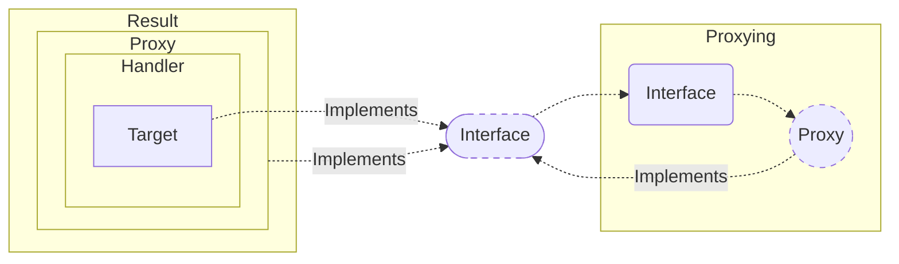
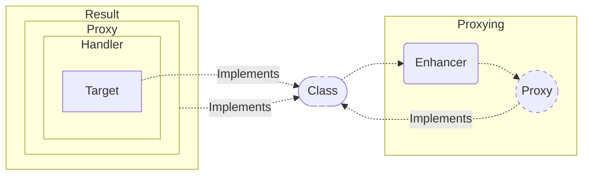

AOP Proxy를 생성할 때 Target의 Interface 유무를 판단하여 다음과 같은 Proxy를 사용한다.

1. Interface가 존재 시, `JDK Dynamic Proxy` 를 통해 생성
2. Interface가 존재하지 않을 시, `CGLib` 를 통해 생성

## JDK Dynamic Proxy 와 CGLib 

`JDK Dynamic Proxy` 는 Java reflection package에 존재하는 Proxy 클래스를 통해 생성된 객체이며, 
<code>CGLib<sub> Code Generator Library</sub></code> 는 Class의 Byte Code 를 조작하여 Proxy 객체를 생성해주는 라이브러리이다.

### JDK Dynamic Proxy 
   
JDK Dynamic Proxy는 자체적인 검증로직을 통해 Target의 Interface를 검증 후 Proxy Factory를 통해 인터페이스를 상속한 Proxy 객체를 생성한다.
이때, Proxy 객체에 Invocation Handler를 통해 하나의 객체로 반환된다.



### CGLib <sub> Code Generator Library</sub>

Spring은 CGLib를 사용사용하여 인터페이스가 아닌 Target의 Class에 대해서도 Enhancer라는 Class를 통해 Proxy를 생성한다.
따라서 생성 시 JDK Dynamic Proxy와 다른점은 아래와 같이 2가지가 있다.

- Interface가 아닌 Class에 대한 Proxy를 생성한다
- ProxyFactory가 아닌 Enhancer를 사용한다.

CGLib는 바이트 코드로 조작하여 Proxy를 생성하기 때문에 JDK Dynamic Proxy 보다 성능이 좋다.
하지만 Final Method 또는 Class에 대해 재정의가 불가하므로 Proxy 생성이 불가하다는 단점이 있다.



## Proxy 생성해보기

```java
// Unit.java

public interface Unit {

    String getName();

    String getDescription();

}

// EngineControlUnit.java

@Service
public class EngineControlUnit implements Unit {

    private static String name = "engine control unit";

    private static String description = "An engine control unit (ECU), also called an engine control module (ECM)" +
            ", is a device which controls multiple systems of an internal combustion engine in a single unit. " +
            "Systems commonly controlled by an ECU include the fuel injection and ignition systems.";

    @Override
    public String getName() {
        return name;
    }

    @Override
    public String getDescription() {
        return description;
    }
    
}
```

`Enhancer` 를 통해 위와 같이 정의된 클래스를 CGLib Proxy 객체를 생성 할 수 있다. 
아래와 같이 Superclass 를 지정하고, callback 함수를 설정해주면 메소드가 호출될 시 callback 메소드가 호출된다.

```java
Enhancer enhancer = new Enhancer();
enhancer.setSuperclass(EngineControlUnit.class);
enhancer.setCallback((FixedValue) ()-> "Hello CGLib!");
EngineControlUnit proxy = (EngineControlUnit) enhancer.create();
```

또한 Callback 설정 시 `MethodInterceptor` 를 사용하면 좀 더 구체적인 구현이 가능하다.

```java
enhancer.setCallback((MethodInterceptor) (obj, method, args, proxy)-> {
    if(method.getName().equals("getDescription"))
        return value;

    return proxy.invokeSuper(obj, args);
});
```

