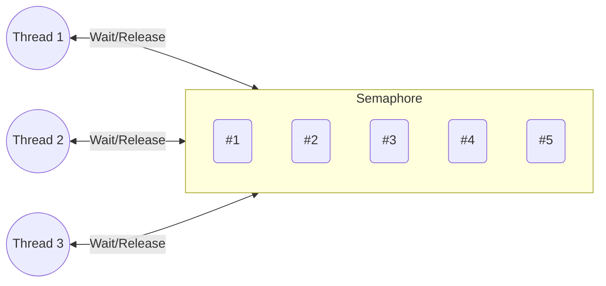
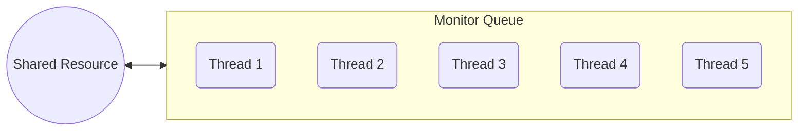

# Thread Safe

Multi Thread 환경에서 여러 공유 자원에 여러 스레드가 동시에 접근해도 문제가 되지 않도록 Thread-Safe 를 고려해야한다.
Thread Safety를 지키기 위해서는 아래와 같은 4가지 방법을 고려해야한다.

1. 상호 배제 <sub>Mutual Exclusion</sub>
2. 원자 연산 <sub>Atomic Operation</sub>
3. 쓰레드 지역 저장소 <sub>Thread-Local Storage</sub>
4. 재진입성 <sub>Re-Entrancy</sub>

## 1. 상호 배제 <sub>Mutual Exclusion</sub>

둘 이상의 프로세스가 동시에 임계 영역<sub>CS: Critical Session</sub> 에 진입하는것을 방지하기 위해 사용되는 알고리즘이다.

상호 배제에는 `enterCS()`, `exitCS()` 두가지의 Primitive <sub>기본 연산</sub> 이 존제한다.
이는 각각 진입 전, 후에 실시해야할 연산을 실행하게된다.

- enterCS() Primitive : CS 진입 전 다른 프로세스가 있는지 검사; 다른 프로세스가 있다면 대기.
- exitCS() Primitive : CS 를 빠져나올 때, 후처리를 실행; 프로세스가 CS 벗어남을 표시 

위 두가지 기본 연산을 위해 `Mutual Exclusion`, `Progress`, `Bounded Waiting`과 같은 3가지 요구사항을 만족시켜야한다.

- Mutual Exclusion <sub>상호 배제</sub> : CS 에 프로세스가 있으면 다른프로세스의 진입을 금한다.
- Progress <sub>진행</sub> : CS 에 프로세스가 없다면 CS 에 진일 할 수 있어야한다.
- Bounded Waiting <sub>유한한 대기</sub> : 프로세스의 CS 진임은 유한한 시간 내에 허용되어야 하며 언젠간 들어갈 수 있게 하여 기아상태를 방지해야한다.

상호 배제에는 대표적으로 `Mutex`, `Semaphore`, `Monitor` 등.. 의 방법이 있다.

### 1.1 Mutex

뮤텍스는 Mutual Exclusion 의 줄임말로, 공유 자원을 사용하기 전에 잠구고 사용한 후에 잠금해제하는 간단한 방식이다.

```mermaid
flowchart LR

    Thread1((Thread 1))
    Thread2((Thread 2))

    subgraph Mutex
        SharedResource (#1)
    end

    Thread1 <-->|Wait/Release| Mutex
    Thread2 <-->|Wait/Release| Mutex
```

### 1.2 Semaphore

Semaphore 는 Atomic 하게 제어되는 정수 변수로, 공유자원에 접근할 수 있는 허용치를 나타낸다.
만약 값이 0 이면 자원에 접근 불가하게 Block 처리를, 0 보다 크면 접근함과 동시에 값을 1 감소시킨다. 

Semaphore 는 `변수 S` 와 `P 연산`<sub>wait()</sub>, `V 연산`<sub>signal()</sub> 으로 구성되며,
공유 자원에 접근 시 P 연산을 진행하여 변수 S 를 1 감소시킨다. 만약 음수라면 대기열에서 기다리게된다.
반대로 공유 자원에서 벗어날 때 V 연산을 진행하여 변수 S 를 1 증가하여 대기열의 맨 앞 프로세스를 깨워 CS를 허용한다.



### 1.3 Monitor

Semaphore 를 사용하기 위해서는 임계구역에 명시적으로 상호 배제 로직을 구현해야한다.
Monitor 는 이러한 로직을 추상화하고, CS 접근에 대한 인터페이스만 제공한다.
또한 공유 자원도 외부로부터 캡슐화하여 숨겨진다.



Java 의 `Synchronized` 키워드가 Monitor 를 활용하여 구현되었다. 

위에서 소개한 `Mutex`, `Semaphore`, `Monitor` 외에도 
`Dekker`, `Peterson`, `Dijkstra`, `Lamport's bakery`, 등.. 의 알고리즘이 존재한다.

